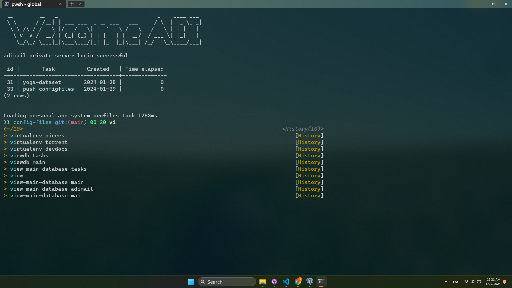
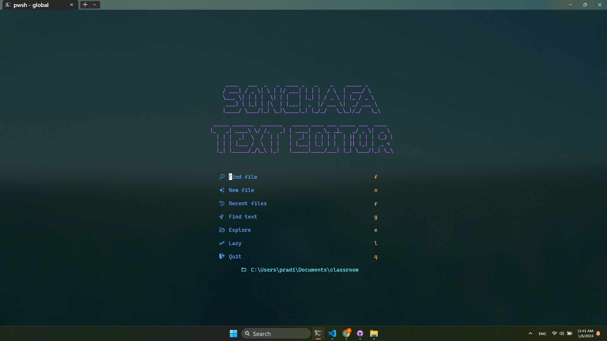
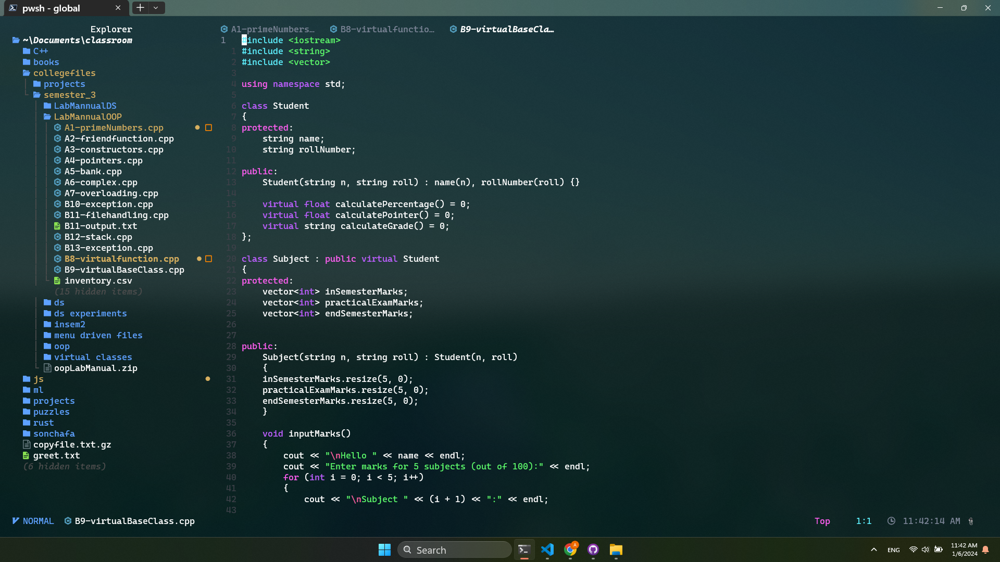
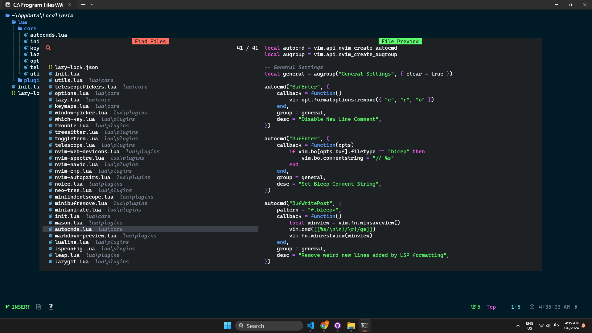
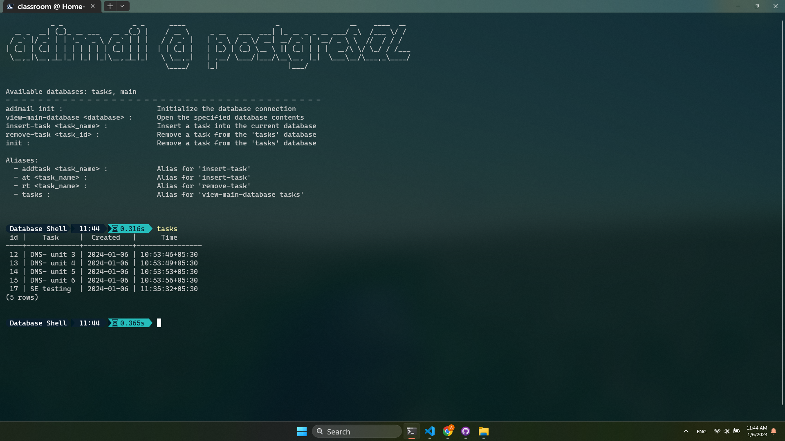

  <a href="https://adimail.github.io/">
    <picture>
      
    </picture>
    <h1 align="center">Windots</h1>
  </a>

My personal Windows-friendly dotfiles. Supports automatic installation of dependencies and configuration of Windows Terminal, Neovim, PowerShell Core and more!

## 🎉 Features

- **Automated Dependency Installation:** Utilises [Winget](https://learn.microsoft.com/en-us/windows/package-manager/winget/) and [Chocolatey](https://chocolatey.org/) for streamlined installation of required dependencies. Checks and notifies pending software updates with a 📦 icon in the prompt.
- **Automated Update Checks:** Regularly checks for updates using git. If updates are pending, a notification is displayed when starting a new PowerShell session.

- **Centralized Configuration:** Brings together scattered Windows configuration files into one organized location for easy access and management.
- **Tailored Colour Scheme:** Powered by my very own [CYBERDREAM](https://github.com/scottmckendry/cyberdream.nvim) colourscheme - high-contrast and vibrant for optimal _Eye Stimulation™_.

## ✅ Pre-requisites

- [PowerShell 7](https://learn.microsoft.com/en-us/powershell/scripting/install/installing-powershell-on-windows?view=powershell-7.3#install-powershell-using-winget-recommended)
- [Git](https://winget.run/pkg/Git/Git)
- [Nerd Fonts](https://www.nerdfonts.com/)
- [Neovim](https://neovim.io/)
- [PsReadline](https://github.com/PowerShell/PsReadline)
- Install using PowerShell: `Install-Module -Name PSReadline -Force -SkipPublisherCheck`
- [Oh-My-Posh](https://ohmyposh.dev/)
- Install using PowerShell: `Install-Module oh-my-posh -Scope CurrentUser`

## 🚀 Installation

> [!WARNING]\
> Under _**active development**_, expect changes. Existing configuration files will be overwritten. Please make a backup of any files you wish to keep before proceeding.

## 📸 Screenshots

  

