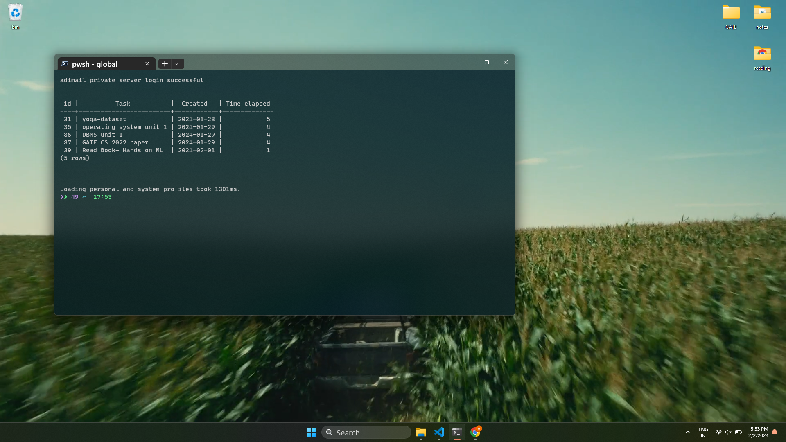

<p align="center">
  <a href="https://adimail.github.io/">
    <picture>
      
    </picture>
    <h1 align="center">adimail config files</h1>
  </a>
</p>

A collection of configuration files for powershell, neovim, zsh & vscode

> Also includes scripts fot my personal task managment system build using postgresql and scripts written in GO

Before getting started, ensure that you can run PowerShell scripts from your source. Execute the following command in PowerShell:

```powershell
Set-ExecutionPolicy -Scope Process -ExecutionPolicy Unrestricted
```

<details>
  <summary> <h3>Dependencies<h3/> </summary>

Neovim text editor

```powershell
winget install --id=Neovim.Neovim  -e
```

Oh My Posh

```powershell
winget install JanDeDobbeleer.OhMyPosh -s winget
```

PSReadLine

```powershell
Install-Module PSReadLine -AllowPrerelease -Force
```

figlet (Requires [npm](https://nodejs.org/en/download))

```powershell
npm i figlet
```

</details>

## Requirments

- [PowerShell 7](https://learn.microsoft.com/en-us/powershell/scripting/install/installing-powershell-on-windows?view=powershell-7.3#install-powershell-using-winget-recommended)
- [Git](https://www.git-scm.com/downloads)
- [Nerd Fonts](https://www.nerdfonts.com/)
- [Neovim](https://neovim.io/)
- [Node.js](https://nodejs.org/en/download)
- MySQL/PgAdmin (optional)

## PowerShell Configuration for Task Management with PostgreSQL

I have created a set of PowerShell functions and configuration files to interact with a PostgreSQL database for managing my tasks (a todo list that appears everytime I open powershell)

**_The scripts for dbm are written in golang_**

### Command Functions:

- `view-main-database` function: Allows viewing the contents of a specified database.
- `insert-task` function: Inserts a task into the current database.
- `remove-task` function: Removes a task from the 'tasks' database.

### Aliases:

| Alias           | Original Command           |
| --------------- | -------------------------- |
| `addtask`, `at` | `insert-task`              |
| `at`            | `insert-task`              |
| `rt`            | `remove-task`              |
| `tasks`         | `view-main-database tasks` |

### Task Management with PostgreSQL Overview

The database schema includes a table named `tasks` with columns for task information, and a trigger to automatically update the "Time elapsed" column. Find the schema in [setup.sql](https://github.com/adimail/config-files/blob/main/pwsh/setup.sql). You can setup your username and password for database in `database.ps1` file

## 📸 Screenshots




<hr>

<p align="center">
  <a href="https://adimail.github.io">
    
  </a>
</p>
